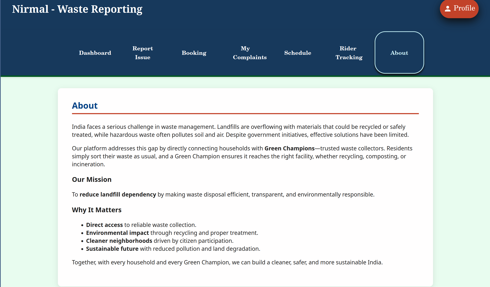
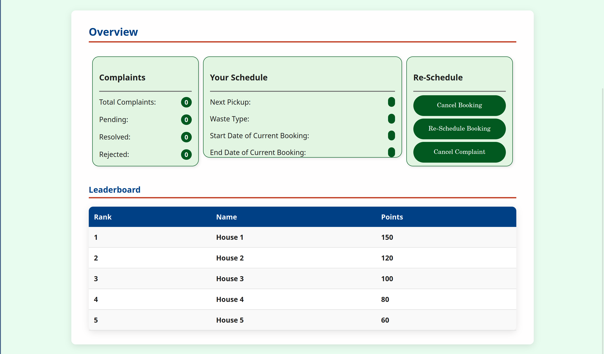
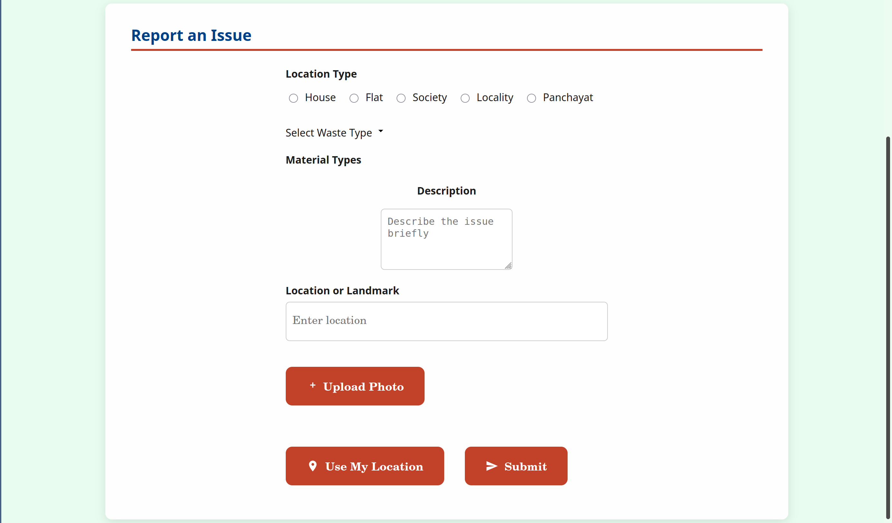
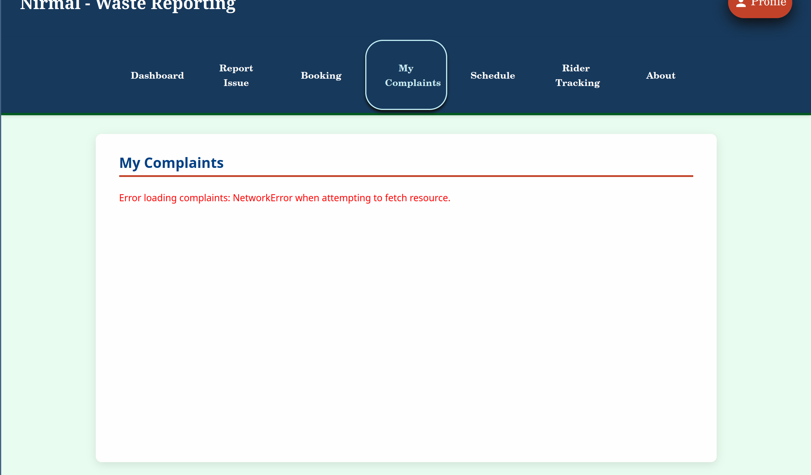
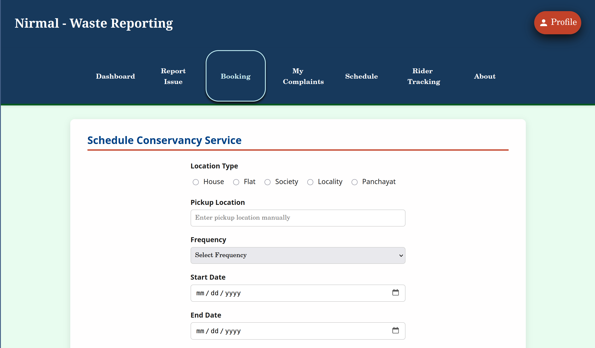
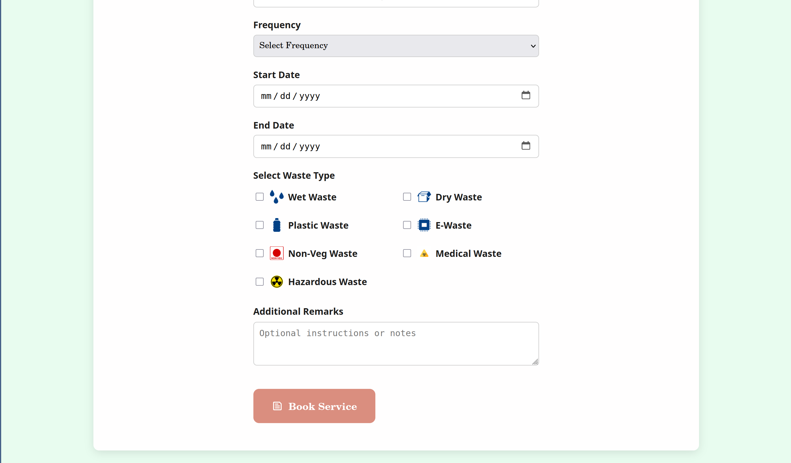
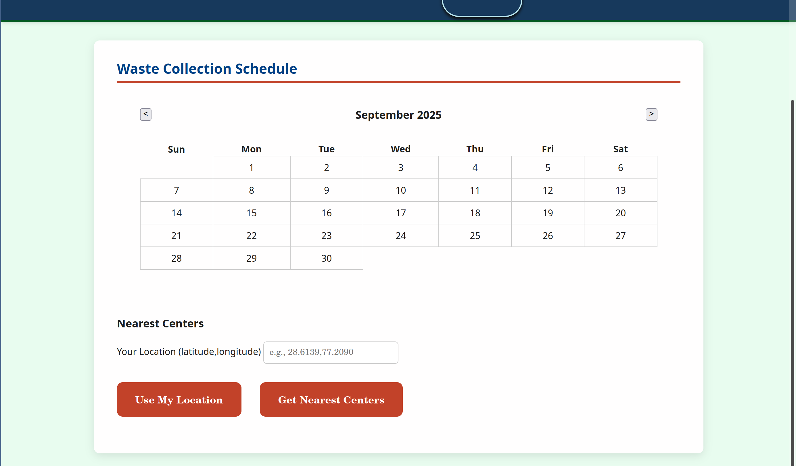
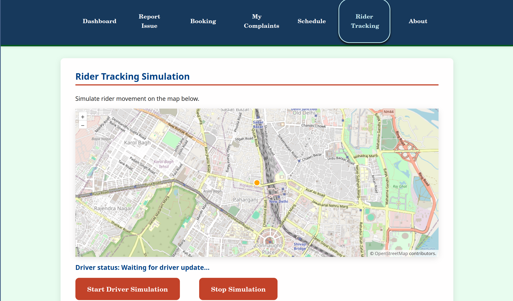

# **NIRMAL - Waste Management System**

##Why It Matters
- This project  allows users to report waste issues, track collection schedules, and promote eco-friendly practices in their communities in a simple and easy way.
- We aim to fix the way waste is collected and sorted so that they don't end up in landfills but instead can be repurposed.
- We want to give our users full control of their waste collection schedule and connect them directly with waste collection services





## Features
### Frontend Features
- **Multi-user Authentication**: Support for different user types
- **Waste Reporting**: Submit complaints with photos and location
  
  
- **Service Booking**: Schedule conservancy services
  
  
- **Collection Scheduling**: Calendar-based waste collection planning
  
- **Real-time Tracking**: Rider tracking simulation
  
- **Responsive Design**: Works on desktop and mobile

### Backend Features
- **JWT Authentication**: Secure token-based authentication
- **RESTful APIs**: Clean API endpoints for all operations
- **Dual Database**: MySQL for relational data, MongoDB for activity logs
- **User Management**: Support for multiple user types with role-based access
- **Data Validation**: Input validation and error handling
- **CORS Support**: Cross-origin requests for frontend integration

## Project Structure
```
nirmal-project/
│
├── frontend/                      # HTML/CSS/JS frontend
│   └── Work Main/Work/
│       ├── *.html                 # User interface pages
│       ├── js/                    # JavaScript files
│       └── css/                   # Stylesheets
│
├── backend/                       # Spring Boot backend
│   ├── src/main/java/com/example/demo/
│   │   ├── controller/            # REST API controllers
│   │   ├── model/                 # Data models (JPA & MongoDB)
│   │   ├── repo/                  # Data repositories
│   │   ├── service/               # Business logic services
│   │   ├── security/              # JWT security configuration
│   │   └── util/                  # Utility classes
│   ├── src/main/resources/
│   │   └── application.properties # Database & app configuration
│   └── build.gradle               # Gradle build configuration
│
└── docker/                        # Containerization
    ├── docker-compose.yml         # MySQL + MongoDB setup
    └── db-init-scripts/           # Database initialization
```

##  Quick Start
### Prerequisites
- Java 17+
- MySQL 8.0+
- MongoDB
- Docker (optional)

### Option 1: Using Docker (Recommended)
1. **Start the databases**:
   ```bash
   cd docker
   docker-compose up -d
   ```
2. **Start the backend**:
   ```bash
   cd backend
   ./gradlew bootRun
   ```
3. **Open the frontend**:
   - Open `Work Main/Work/index.html` in your browser
   - Or serve it using a local server (e.g., Live Server extension)

### Option 2: Manual Setup
1. **Start MySQL**:
   - Create database: `nirmal_db`
   - Username: `root`
   - Password: `97488`
2. **Start MongoDB**:
   - Default port: `27017`
   - Database: `nirmal_activity_logs`
3. **Start the backend**:
   ```bash
   cd backend
   ./gradlew bootRun
   ```
4. **Open the frontend**:
   - Open `Work Main/Work/index.html` in your browser

## Demo Credentials

| User Type    | Email                 | Password    | Additional Info   |
|--------------|-----------------------|-------------|-------------------|
| Green Center | admin@greencenter.com | password123 | Reg: GC001        |
| NGO          | admin@ngo.com         | password123 | Reg: NGO001       |
| Conservancy  | admin@conservency.com | password123 | Reg: CONS001      |
| Rider (NGO)  | rider@ngo.com         | password123 | Type: NGO Rider   |
| Rider (Conservancy) | rider@conservency.com | password123 | Type: Conservancy Rider |
| User         | user@test.com         | password123 | Regular user      |

## API Endpoints
### Authentication (`/api/auth`)
- `POST /login` - User login
- `POST /register` - User registration  
- `POST /logout` - User logout
### Complaints (`/api/complaints`)
- `POST /` - Submit complaint
- `GET /` - Get user complaints
- `GET /{id}` - Get specific complaint
- `PUT /{id}/status` - Update complaint status
### Bookings (`/api/bookings`)
- `POST /` - Create booking
- `GET /` - Get user bookings
- `GET /{id}` - Get specific booking
- `PUT /{id}/status` - Update booking status
### Schedules (`/api/schedules`)
- `POST /` - Create/update schedule
- `GET /` - Get user schedules
- `GET /date/{date}` - Get schedules by date
- `DELETE /{id}` - Delete schedule

## Database Schema
### MySQL Tables
- **users**: User accounts and profiles
- **complaints**: Waste-related complaints
- **bookings**: Conservancy service bookings
- **schedules**: Waste collection schedules
### MongoDB Collections
- **activity_logs**: User activity tracking

##  Development
### Backend Development
```bash
cd backend
./gradlew bootRun --args='--spring.profiles.active=dev'
```
### Frontend Development
- Edit files in `Work Main/Work/`
- Use Live Server extension for local development
- API base URL: `http://localhost:8080/api`
### Database Management
- **MySQL**: Use any MySQL client (e.g., MySQL Workbench)
- **MongoDB**: Access via MongoDB Express at `http://localhost:8081`

##  Security
- JWT tokens for authentication
- Password encryption using BCrypt
- CORS configuration for frontend integration
- Input validation and sanitization
- Role-based access control

##  User Types & Permissions
1. **USER**: Regular users who can submit complaints and book services
2. **GREEN_CENTER**: Green center administrators
3. **NGO**: NGO administrators  
4. **CONSERVANCY**: Conservancy administrators
5. **RIDER**: Waste collection riders (NGO or Conservancy)

##  Docker Services
- **MySQL**: Database for main application data
- **MongoDB**: Database for activity logs
- **Mongo Express**: Web-based MongoDB admin interface

##  Configuration
### Backend Configuration (`application.properties`)
- Database connections (MySQL & MongoDB)
- JWT secret and expiration
- CORS settings
- Server port (8080)
### Frontend Configuration
- API base URL: `http://localhost:8080`
- JWT token storage in localStorage
- User session management

##  Troubleshooting
### Common Issues
1. **Database Connection Errors**:
   - Ensure MySQL is running on port 3306
   - Check database credentials in `application.properties`
   - Verify database `nirmal_db` exists
2. **CORS Errors**:
   - Ensure backend is running on port 8080
   - Check CORS configuration in `SecurityConfig.java`
3. **Authentication Issues**:
   - Verify JWT token is stored in localStorage
   - Check token expiration (24 hours default)
4. **Frontend Not Loading**:
   - Use a local server (not file:// protocol)
   - Check browser console for errors

##  Monitoring
- **Application Logs**: Check console output for backend logs
- **Database Logs**: Monitor MySQL and MongoDB logs
- **Activity Logs**: View user activities in MongoDB

##  Contributing
1. Fork the repository
2. Create a feature branch
3. Make your changes
4. Test thoroughly
5. Submit a pull request

##  License
This project is licensed under the MIT License.

##  Support
For issues and questions:
1. Check the troubleshooting section
2. Review the API documentation
3. Check application logs
4. Create an issue in the repository

---

**Made with ❤️ for better waste management**